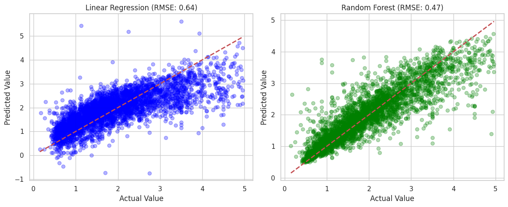

# California Housing Price Prediction 🏠

## 📌 Project Overview
This project uses Machine Learning to predict median house values in California districts. Moving beyond basic theory, I performed exploratory data analysis (EDA), handled data outliers, and compared different regression models.

## 📊 Key Insights from Data

* **Top Predictor:** Median Income (`MedInc`) is the strongest driver of house prices.
* **Correlation:** It has a high positive correlation of **0.69**.
* **Data Cleaning:** Removed "censored" data points where prices were capped at $500,000.

## 🛠️ Tech Stack
* **Language:** Python
* **Libraries:** Pandas, NumPy, Scikit-Learn
* **Visualization:** Matplotlib, Seaborn

## 🚀 How to Use
1. Clone this repository.
2. Install libraries: `pip install -r requirements.txt`.
3. Open the `.ipynb` file to see the analysis.

## 📈 Model Performance

I compared two models to see which could best handle the non-linear geographical data of California:

| Model | RMSE (Error) | Result |
| :--- | :--- | :--- |
| Linear Regression | 0.64 | Baseline |
| **Random Forest** | **0.47** | **Winner** |

The Random Forest model significantly reduced the error by capturing complex patterns that a straight line could not see.
